# fe-codegen-workbench

前端代码生成统一工作台 Skill，覆盖从环境检测到代码审查的完整闭环。

基于 SKILL.md 开放标准，兼容 Claude Code、Codex CLI、Cursor、ChatGPT 等所有 AI 编码工具。

## 适用场景

- B 端管理系统（列表页、表单页、详情页、CRUD）
- C 端应用、H5 移动端（文件上传、水印等）
- 中后台系统、大数据渲染（虚拟列表、分页下拉）
- 批量操作（Schema 驱动表单）

## 支持的技术栈

| 技术栈 | UI 库 | 模板前缀 | 内置知识库 |
|--------|-------|----------|-----------|
| React | Ant Design / Ant Design Pro | `react-*` | `react-antdpro-knowledge.md` |
| Vue 3 | Element Plus | `vue3-*` | `vue-knowledge.md` |
| Vue 2 | Element UI / Vant | `vue2-*` | `vue-knowledge.md`（兼容部分） |

## 内置模板（16 个）

### React（10 个）

| 模板 ID | 名称 | 适用场景 |
|---------|------|---------|
| `react-standard-list-crud` | 标准列表页 | ProTable + 搜索 + CRUD |
| `react-standard-modal-form` | 弹窗表单 | <10 字段的新增/编辑 |
| `react-drawer-form` | 抽屉编辑表单 | 10-20 字段的编辑 |
| `react-drawer-detail` | 抽屉详情 | 快速查看详情 |
| `react-nonstandard-detail` | 独立详情页 | 审批流程/附件预览 |
| `react-standard-form-page` | 独立表单页 | >20 字段的复杂表单 |
| `react-import-list-modal` | 导入弹窗 | Excel 数据导入 |
| `react-pc-file-upload` | PC 文件上传 | 图片/文件上传 |
| `react-virtual-paginated-select` | 大数据渲染下拉 | 8000+ 条数据 |
| `react-batch-schema-form` | 批量 Schema 表单 | 动态批量编辑 |

### Vue 3（2 个）

| 模板 ID | 名称 | 适用场景 |
|---------|------|---------|
| `vue3-standard-list-crud` | 标准列表页 | Element Plus 列表页 |
| `vue3-virtual-paginated-select` | 大数据渲染下拉 | el-table-v2 |

### Vue 2（4 个）

| 模板 ID | 名称 | 适用场景 |
|---------|------|---------|
| `vue2-standard-list-crud` | 标准列表页 | Element UI 列表页 |
| `vue2-h5-file-upload` | H5 文件上传 | Vant + 水印 |
| `vue2-pc-file-upload` | PC 文件上传 | Element Upload |
| `vue2-virtual-paginated-select` | 大数据渲染下拉 | vue-virtual-scroller |

## 核心流程

### 整体流程图（Mermaid，GitHub 可直接渲染）

```mermaid
flowchart TD
    Start([用户输入需求]) --> S1[1. 环境检测<br/>扫描 package.json / 技术栈 / UI 库]
    S1 --> NewProj{项目存在?}
    NewProj -- 否 --> Create[默认创建 React + TS + AntdPro<br/>用户确认技术栈]
    NewProj -- 是 --> S2
    Create --> S2[2. 需求分析<br/>提取: 页面类型 / 字段 / 业务规则<br/>额外提取: designSignal 风格信号]
    S2 --> GateType{是否新建任务<br/>且未显式跳过?}

    GateType -- 是 --> S25[2.5 设计推荐节点]
    GateType -- 否<br/>增量修改 / 显式默认 --> S3

    S25 --> Fetch[🌐 远程优先抓 getdesign.md<br/>覆盖本地 index.json]
    Fetch -- 远程失败 --> Local[💾 读本地 index.json<br/>+ warning 提示]
    Fetch -- 成功 --> Recommend
    Local -- 本地也缺失 --> Skip25[静默跳过 2.5<br/>走 AntD 默认]
    Local --> Recommend

    Recommend[🎯 基于需求+风格词<br/>主动推荐 3 个品牌 + 1 个不使用]
    Recommend --> Explicit{用户显式品牌<br/>或本地路径?}
    Explicit -- 是 --> Direct[⚡ 跳过 ask_question<br/>直接使用指定品牌/路径]
    Explicit -- 否 --> Ask[ask_question:<br/>1. Linear / 2. Notion / 3. Stripe<br/>4. ⬜ 不使用品牌 兜底]
    Ask --> UserPick{用户选择}
    UserPick -- 选品牌 --> SetBrand[selectedBrandId = brandId]
    UserPick -- 选不使用 / 超时 --> NullBrand[selectedBrandId = null]
    Direct --> SetBrand

    NullBrand --> S3
    Skip25 --> S3
    SetBrand --> S35[3.5 DESIGN.md 加载<br/>🌐 远程优先抓 detailUrl<br/>解析 color/font/radius]
    S35 -- 远程失败 --> LocalMd[💾 读本地 DESIGN.md + warning]
    LocalMd -- 本地也缺失 --> Degrade[降级 AntD<br/>跳过主题层]
    S35 --> S3
    LocalMd --> S3
    Degrade --> S3

    S3[3. 模板匹配<br/>按技术栈过滤 component-registry.json] --> TplHit{命中模板?}
    TplHit -- 是 --> S4
    TplHit -- 否 --> AskTpl[暂停询问: 用最近模板? 自由生成? 用户自处理?]
    AskTpl --> S4

    S4[4. 页面生成] --> G1[types.ts]
    G1 --> G2[hooks/*.ts]
    G2 --> G3[components/*.tsx]
    G3 --> G4[index.tsx]
    G4 --> G5[index.less]
    G5 --> ThemeCheck{selectedBrandId<br/>非空?}
    ThemeCheck -- 是 --> G6[src/theme/token.ts<br/>ConfigProvider 注入<br/>项目根 DESIGN.md 复制]
    ThemeCheck -- 否 --> S5
    G6 --> S5

    S5[5. 代码审查<br/>code-review-expert 深度审查<br/>+ P0/P1/P2 自检] --> ThemeReview{selectedBrandId<br/>非空?}
    ThemeReview -- 是 --> ThemeAudit[追加主题合规审查<br/>• 主题文件已生成<br/>• ConfigProvider 已挂入<br/>• 业务代码无硬编码色值<br/>• 项目根 DESIGN.md 已复制]
    ThemeReview -- 否 --> End
    ThemeAudit --> End([✅ 交付给用户])

    classDef step fill:#4a90e2,stroke:#2c5f8c,color:#fff
    classDef designStep fill:#e27d4a,stroke:#8c4a2c,color:#fff
    classDef gate fill:#f5c842,stroke:#9c7a08,color:#333
    classDef terminal fill:#6ab04c,stroke:#388a1e,color:#fff
    class S1,S2,S3,S4,S5 step
    class S25,Fetch,Recommend,Ask,S35,G6,ThemeAudit designStep
    class GateType,Explicit,UserPick,TplHit,ThemeCheck,ThemeReview,NewProj gate
    class Start,End terminal
```



### ASCII 简版（纯文本阅读）

```
[1] 环境检测 → [2] 需求分析 → {是否新建+未跳过?}
                                 │
                          ┌──────┴──────┐
                          是             否
                          │              │
                        [2.5]            ↓
                  设计推荐(3+1)        跳过 2.5
                  🌐 远程优先拉 index
                          │              │
                   ┌──────┴──────┐       │
              选品牌            选不使用  │
                   │              │      │
                 [3.5]            ↓      ↓
             DESIGN.md 加载       ────────────→ [3] 模板匹配 → [4] 页面生成 → [5] 代码审查
             🌐 远程优先拉 md                              │                      │
                   │                                    (若选品牌)            (若选品牌)
                   └─────────────────────────→ 追加主题层文件    + 主题合规审查
```

### 关键规则

- 步骤 1–5 为**强制顺序执行**，不可跳步。
- **步骤 2.5 为交互式默认链路**：新建页面 / 新建项目任务默认进入 2.5 节点，主动推荐 3 个品牌 + 1 个"不使用品牌"兜底选项，给用户一次选择机会；用户选"不使用"即走默认样式。显式说"按默认 / B 端标准" 或增量修改任务自动跳过 2.5。
- **步骤 3.5 仅当 `selectedBrandId` 非空时触发**：从 getdesign.md 抓取对应 DESIGN.md 生成主题层。
- 若触发设计链路，业务代码仍 100% 按模板拼装，视觉差异只落在单独生成的"主题层"文件中，**业务代码零硬编码色值/字体**。

**技术栈策略**：现有项目自动检测技术栈并加载对应知识库；新项目默认 React + TypeScript + Ant Design Pro。

**设计系统策略**（见 [DESIGN.md 集成](#designmd-集成可选链路) 小节）：与 [getdesign.md](https://getdesign.md/) 打通，**远程优先 + 本地降级**——默认联网拉取最新设计系统；断网时才回退本地缓存；缓存也缺失时静默降级为 AntD 默认主题。

详见 [SKILL.md](SKILL.md) 和 [使用指南.md](使用指南.md)。

## 模板来源约定

- 本地模板以 `references/components/<template-id>/` 目录为唯一真源
- 每个模板目录至少包含 `sample.md` 和示例代码文件
- `component-registry.json` 负责索引、匹配元数据、组合关系和一致性锚点
- `references/template-matching.md` 负责说明匹配规则、维护方式和 UI Profile

## 目录结构

```
fe-codegen-workbench/
├── SKILL.md                                  # 主调度文件（入口）
├── README.md                                 # 本文件
├── 使用指南.md                                # 使用指南（模板提示词 + 示例）
├── agents/
│   ├── agent.yaml                            # 通用 Agent 接口配置
│   └── openai.yaml                           # OpenAI 兼容入口（与 agent.yaml 保持一致）
└── references/
    ├── environment-setup.md                  # 步骤 1：环境检测与初始化
    ├── requirements-analysis.md              # 步骤 2：需求分析（含 designSignal 抽取）
    ├── design-md-integration.md              # 步骤 2.5/3.5/4/5：DESIGN.md 集成规则
    ├── design-systems/                       # 步骤 2.5/3.5：设计系统薄索引 + 本地缓存
    │   ├── README.md                         #   加载策略（远程优先 + 本地降级）
    │   ├── index.json                        #   69+ 品牌薄索引（id/name/tagline/detailUrl）
    │   └── <brand-id>/                       #   按需缓存的单个 DESIGN.md
    ├── component-registry.json               # 步骤 3：组件注册表索引（JSON）
    ├── template-matching.md                  # 步骤 3：模板匹配规则 + 维护说明
    ├── components/                           # 步骤 3：模板目录（一目录一个模板）
    │   ├── react-*/                          #   React 模板目录（sample.md + 示例代码）
    │   ├── vue3-*/                           #   Vue 3 模板目录（sample.md + 示例代码）
    │   └── vue2-*/                           #   Vue 2 模板目录（sample.md + 示例代码）
    ├── ui-profiles/                          # UI 框架 Profile 抽象
    ├── page-generation.md                    # 步骤 4：生成原则与文件顺序（含主题层）
    ├── code-standards.md                     # 步骤 4：编码规范
    ├── self-review-checklist.md              # 步骤 5：结构化自检清单（含主题合规审查）
    ├── react-antdpro-knowledge.md            # 步骤 4：React + AntdPro 知识库
    ├── vue-knowledge.md                      # 步骤 4：Vue 3 + Element Plus 知识库
    └── external-skills.md                    # 外部 Skills 集成指南
```

## 集成的 Skills

| Skill | 集成等级 | 用途 |
|-------|---------|------|
| `code-review-expert` | 深度集成 | 步骤 5 代码审查（P0-P3 findings） |
| `brainstorming` | 深度集成 | 步骤 2 需求模糊时探索 |
| `getdesign.md` 集成 | 深度集成（可选链路） | 步骤 2.5/3.5/4/5 的设计系统推荐与落地（详见下节） |
| `vercel-react-best-practices` | 知识库参考 | React 性能优化 58 条规则 |
| `vue-best-practices` | 知识库参考 | Vue 3 响应式/组件/状态管理 |
| `frontend-design` | 知识库参考 | 有设计稿时的 UI/UX 设计思维（与 DESIGN.md 链路互斥，不建议同时启用） |
| `ui-ux-pro-max` | 可选增强 | 已安装且明确追求高保真 UI/UX 升级时再启用 |

详见 [references/external-skills.md](references/external-skills.md)。

## 设计类 Skill 整合建议

- **DESIGN.md 链路（推荐）**：需要品牌化视觉时优先走 `getdesign.md` 集成，由 Agent 基于用户风格诉求推荐并自动落地主题层，见下一节。
- `frontend-design` 适合作为 `fe-codegen-workbench` 的条件化增强层：有原型图、品牌视觉稿、营销页或明确视觉升级诉求，但**不走 DESIGN.md 链路**时加载。两者不建议同时启用。
- `ui-ux-pro-max` 更适合作为可选补强，而不是默认强依赖：它更偏社区经验和高保真设计规范，容易与既有设计系统或 B 端模板约束冲突。
- 标准企业 CRUD、表单页、详情页场景下，优先遵循模板注册表、现有组件库和 `code-standards.md`，不要默认引入激进设计策略。

## DESIGN.md 集成（可选链路）

本工作台与 [getdesign.md](https://getdesign.md/) 深度整合，使得生成代码时可以可选地套用 Linear、Stripe、Notion 等 69+ 品牌的设计系统。

### 四条主要使用路径

| 路径 | 触发条件 | Agent 行为 |
|------|---------|-----------|
| 🟢 **默认交互推荐**（新建任务默认走此路径） | 新建页面 / 项目 + 无显式品牌 + 未显式跳过 | 主动从 `index.json` 推荐 3 个品牌 + "不使用品牌" 选项，用户一键选择 |
| 🔵 **显式指定品牌** | _"用 Linear 风格做 XX"_ | 跳过推荐对话，直接加载对应 DESIGN.md，生成主题层 |
| 🟡 **用户显式跳过** | _"按默认 / B 端标准 / 不用设计系统"_ | 自动跳过 2.5，走现状 AntD 默认，和原工作流 100% 等同 |
| 🟠 **增量修改任务** | _"加一列字段 / 修改按钮"_ 等改已有页面 | 自动跳过 2.5，沿用当前主题不打扰；除非用户同时明说换主题 |

**兜底选项永远存在**：进入推荐节点时，ask_question 的第 4 项永远是 _"不使用品牌（使用默认 Ant Design 样式）"_，用户一秒即可退出设计链路。

### 远程优先 + 本地降级

每次进入设计链路时：

```
🌐 第 1 层：远程抓取 getdesign.md
    ├─ 成功 → 覆盖本地缓存 → 使用最新数据 ✓
    └─ 失败 ↓
💾 第 2 层：读本地缓存
    ├─ 存在 → 使用缓存 + warning "使用本地缓存（last updated: ...）"
    └─ 缺失 ↓
❌ 第 3 层：静默降级默认 AntD，业务代码继续正常生成
```

- 默认假设用户有网；本地 `references/design-systems/` 仅作断网兜底
- 任务内单次抓取（避免重复请求），跨任务总是重拉（保证最新）
- 通过 `刷新设计库` 指令可主动强制重抓

### 视觉落地方式（关键不变量）

| 文件 | 作用 | 技术栈 |
|------|------|-------|
| `src/theme/token.ts` | 主题层（单一色值/字体/spacing 源） | React |
| `src/theme/vars.scss` | 主题层 | Vue 3 |
| `tailwind.config.ts` | 主题层扩展 | Tailwind |
| 项目根 `DESIGN.md` | 上下文锚点（供后续生成参考） | 所有 |

**业务代码 `.tsx` / `.vue` 零硬编码色值/字体**，所有视觉通过 token 间接引用。

### 用户指令速查

| 指令 | 作用 |
|------|------|
| `用 <品牌> 风格做 <需求>` | 跳过推荐直接应用某品牌 |
| `列出设计库` | 展示全部可选品牌（含预览色块） |
| `刷新设计库` / `更新设计库` | 主动远程抓取覆盖本地 |
| `离线模式` / `强制使用缓存` | 跳过远程仅用本地 |
| `换成 <品牌> 风格` | 切换主题（仅改 theme 层） |
| `回到默认` | 恢复 AntD 默认（删 theme 层） |

详细规范见 [references/design-md-integration.md](references/design-md-integration.md) 与 [references/design-systems/README.md](references/design-systems/README.md)。

## 组件注册表架构

采用「JSON 索引 + 模板目录」模式，支持三种来源：

| source.type | 说明 | 状态 |
|-------------|------|------|
| `local` | 本地模板目录（`sample.md` + 示例代码） | ✅ 已支持 |
| `npm` | npm 包组件 | 🔜 规划中 |
| `remote` | 远程 URL | 🔜 规划中 |

## 匹配增强

- 组件匹配同时参考 `keywords`、`synonyms`、`antiKeywords`
- 支持“1 个主模板 + 多个可组合模板”的拼装结果
- 每个模板可声明 `priority`、`composableWith`、`consistencyAnchors`
- UI 组件库能力通过 `references/ui-profiles/*.json` 抽象，降低未来替换成本

## 核心规则

- **hooks / composables 优先**：先生成数据处理层，再生成 UI 层
- **全局类型禁止 import**：`global.d.ts` 中的类型直接使用
- **禁止 mock**：不生成任何假数据
- **文件生成顺序**：`types.ts` → `hooks/` → `components/` → `index.tsx` → `index.less` → （若选品牌）`src/theme/*` + 项目根 `DESIGN.md`
- **技术栈知识库驱动**：根据检测到的技术栈自动加载对应知识库
- **业务代码零硬编码视觉**：色值/字体/spacing 统一走主题层 token，即使在主题启用场景下业务代码仍不感知具体品牌
- **远程优先（设计链路）**：DESIGN.md 链路一旦启用，索引和 DESIGN.md 都优先从 getdesign.md 实时抓取；远程失败才回退本地缓存，缓存也缺失时静默降级默认 AntD

## 安装

```bash
# 个人级别（所有项目可用）
# Claude Code
cp -r fe-codegen-workbench ~/.claude/skills/

# Codex CLI
cp -r fe-codegen-workbench ~/.codex/skills/

# Cursor
cp -r fe-codegen-workbench ~/.cursor/skills-cursor/

# 项目级别（仅当前项目）
cp -r fe-codegen-workbench .claude/skills/
```

## 推荐搭配安装

```bash
npx skills add vercel-labs/agent-skills --skill react-best-practices
npx skills add anthropics/skills --skill frontend-design
```
